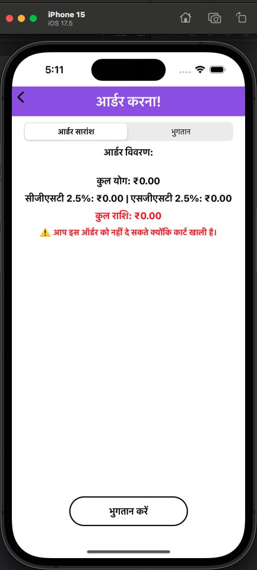

<h1 align="center">Taste Bazaar iOS App</h1>

Taste Bazaar is a restaurant ordering app built entirely using Swift in Xcode, following the MVC architecture. The app does not use Storyboards and is created entirely programmatically to provide a more engaging and user-friendly experience.

## Problem Statement

The goal of the app is to provide a seamless restaurant experience where users can browse cuisines, order dishes, and view their cart. Below is a breakdown of the screens and features:

### **Screen 1: Home Screen**
The Home screen contains the following segments:

- **Segment 1: Cuisine Category Cards**
  - Horizontal infinite scroll with cuisine categories like North Indian, Chinese, Mexican, South Indian, and Italian.
  - Each cuisine card displays:
    - Image and name of the cuisine.
    - Rectangular shape with rounded corners.
    - Swipe enabled on both sides.
    - Tapping a card navigates to Screen 2.

- **Segment 2: Top 3 Famous Dishes**
  - Displays the top 3 dishes of the restaurant in a tile format.
  - Each dish shows:
    - Image, price, and rating.
    - Option to add the same dish multiple times.

- **Segment 3: Cart Button**
  - Allows navigation to Screen 3.

- **Segment 4: Language Selection Button**
  - Enables switching between Hindi and English.

### **Screen 2: Select from Cuisine Menu**
- Displays the dishes specific to the selected cuisine.
- Each dish shows:
  - Image and price.
  - Option to add the same dish multiple times.

### **Screen 3: Cart Screen**
- Displays the cuisines selected by the user for the order.
- Shows:
  - List of selected dishes.
  - Net total amount of the dishes.
  - CGST and SGST of 2.5% each.
  - Grand total (sum of net total and tax).
  - Button to place the order.

## Technologies Used
- **Language**: Swift
- **IDE**: Xcode
- **Architecture**: MVC (Model-View-Controller)
- **API Integration**: Custom APIs for retrieving data (dishes, cuisines, etc.)

## Features
- Smooth and interactive UI built without Storyboard.
- Horizontal infinite scroll for cuisines.
- Dynamic cart management allowing users to add multiple dishes.
- Language support for Hindi and English.
- Real-time price and tax calculation in the cart.

## Setup Instructions

1. Clone this repository to your local machine:
    ```bash
    git clone https://github.com/your-username/TasteBazaar-iOSApp.git
    ```
2. Open the project in Xcode:
    ```bash
    open Taste Bazaar.xcodeproj
    ```
3. Run the app on a simulator or physical device.

> Make sure you have a working internet connection to access APIs.

## API Endpoints

Here is a list of the API endpoints used in the app:

| **S.No.** | **Section**              | **API Endpoints**         | **Description**                                                                 |
|-----------|--------------------------|---------------------------|---------------------------------------------------------------------------------|
| 1         | **Cuisine & Dish List**   | `get_item_list`           | This API retrieves a list of food items grouped by cuisine categories. It returns details like item names, images, prices, and ratings. |
| 2         | **Item Info**             | `get_item_by_id`          | This API fetches details of a specific item based on the provided item_id.      |
| 3         | **Dish Filter**           | `get_item_by_filter`      | This API allows users to filter food items based on cuisine type, price range, and minimum rating. |
| 4         | **Payment Details**       | `make_payment`            | This API is used to make payment for the ordered food items. The payment details include the total amount, number of items, and individual item details. |


## Link to PDF Document for all API's Information:

[View the PDF Document](ProjectOutputs/API-RecordDocument/TasteBazaar-APIs-Protected-Info.pdf)


## Launch Screen Snapshot and Video

Below is the launch screen for the app:

**Launch Screen Snapshot**:

<p align="center">
  
</p>

**Launch Screen Video**:

<p align="center">
  
</p>


[Launch Screen Video](ProjectOutputs/WorkingVideos/Common/appLoading.mov)

## Additional Snapshots

Here are additional views of the app:

- **App Look on Mobile**:
  
<p align="center">
  
</p>

- **Logo Image**:
  
<p align="center">
  
</p>

- **App Icon**:

<p align="center">
  
</p>

## Application Snapshot (Running in English)

Here’s how the app looks when running in **English**:

**English UI Snapshots**:

|  |  |  |
|------------------------------------------|------------------------------------------|------------------------------------------|
|  |  |  |
|  |  |  |
|  |  |  |
|  |  |  |
|  |  |  |
|  |  |  |
|  |  |  |

**English UI Video**:

<p align="center">
  
</p>


[English UI Video](ProjectOutputs/WorkingVideos/AppInEnglish/AppWorkingInEnglishFast.mp4)

## Application Snapshot (Running in Hindi)

Here’s how the app looks when running in **Hindi**:

**Hindi UI Snapshots**:

|  |  |  |
|------------------------------------------|------------------------------------------|------------------------------------------|
|  |  |  |
|  |  |  |
|  |  |  |
|  |  |  |
|  |  |  |
|  |  |  |

**Hindi UI Video**:

<p align="center">
  
</p>


[Hindi UI Video](ProjectOutputs/WorkingVideos/AppInHindi/AppWorkingInHindi.mov)

## Complete App Working Video

Watch the complete working video of the app:

<p align="center">
  
</p>


[Complete App Video](ProjectOutputs/WorkingVideos/CompleteAppWorking/FullAppWorking.mov)

## Contributing

**No contributions are currently accepted for this project.** Feel free to use or explore the code as you wish, but please note that modifications or additions are not allowed unless explicitly authorized by the owner.

## License

This project is **"All Rights Reserved"**. You may not use, modify, or distribute this code without the explicit permission of the owner.
